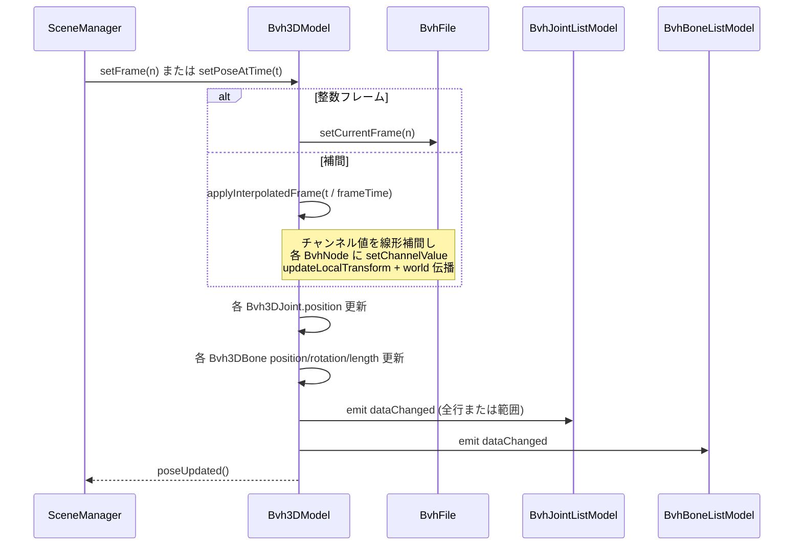

# 3D Data Model 層 設計

## 目的

BVH File Model（`src/core/bvhfile`）が保持するスケルトン構造とモーションデータを、Qt Quick 3D 向けの **描画可能な内部状態** に変換し、QML へ **フラットなリストモデル** として公開する層を定義する。

本層は QML や Scene Manager の実装詳細に依存せず、**1 BVH インスタンス = 1 スケルトン** という単位で Pose（姿勢）を計算・キャッシュする。

---

## アーキテクチャ上の位置

```
┌─────────────────────────────────────────────────────────────┐
│  QML View Layer & Animation Engine                          │
│  (Repeater3D, View3D, タイムライン)                          │
└───────────────────────────┬─────────────────────────────────┘
                            │ JointListModel / BoneListModel
                            │ (QAbstractListModel)
┌───────────────────────────▼─────────────────────────────────┐
│  Scene Manager (Controller & Adapter)                       │
│  フレーム番号・再生状態・シーンオフセット・表示制御            │
└───────────────────────────┬─────────────────────────────────┘
                            │ setFrame() / setPoseAtTime()
┌───────────────────────────▼─────────────────────────────────┐
│  3D Data Model 層  ← 本ドキュメント                          │
│  Bvh3DModel, BvhJointListModel, BvhBoneListModel            │
└───────────────────────────┬─────────────────────────────────┘
                            │ setCurrentFrame() / 構造参照
┌───────────────────────────▼─────────────────────────────────┐
│  BVH File Model 層 (src/core/bvhfile)                       │
│  BvhFile, BvhNode, BvhMotion, Channel                       │
└─────────────────────────────────────────────────────────────┘
```

### 基本方針（architecture.md との整合）

| 方針 | 3D Data Model 層での解釈 |
|------|--------------------------|
| 座標計算の委譲 | C++ は **BVH ファイル座標系** における関節位置・ボーン方向を計算する。シーン全体のワールド変換（複数 BVH の併置オフセット等）は Scene Manager が QML 側の親 `Node` に適用し、Qt Quick 3D に委譲する。 |
| データのフラット化 | 内部では BVH 木構造を保持するが、QML へは `QAbstractListModel` 2 本（Joint / Bone）のみ公開する。QML 側で再帰的ノード構築は行わない。 |
| アニメーション駆動 | 通常パスは整数フレーム索引。要件 F11-2（補間再生）に備え、任意で **浮動小数時間** から Pose を生成する API も提供する。 |

---

## スコープ

### 含む

- 1 BVH ファイルに対応する `Bvh3DModel` のライフサイクル管理
- フレーム（または時間）に応じた Pose 更新
- Joint / Bone のフラットリスト生成と `QAbstractListModel` 公開
- End Site の描画用ジョイント生成
- スケルトン単位の表示フラグ・識別色（Scene Manager 経由で QML に渡すメタデータ）

### 含まない

- BVH ファイルのパース（BvhFile の責務）
- カメラ・照明・グリッド（QML View / Scene Manager）
- サイドバーの階層ツリー（BvhFile の静的構造を直接利用）
- マウスヒットテスト用ワールド行列の取得（将来、Scene Manager + QML 連携）

### 既存コードとの関係

- `src/ui` 以下の既存実装（`BvhSceneModel` 等）は本設計の対象外とし、参考にしない。
- 実装先は architecture.md に従い `src/ui/bvhdatamodel/` とする。

---

## 要件との対応

| 要件 ID | 内容 | 3D Data Model 層での対応 |
|---------|------|--------------------------|
| F03 | スケルトン 3D 描画 | JointList / BoneList を生成。End Site を仮想ジョイントとして含める。 |
| F03 | 色分け・表示/非表示 | `Bvh3DModel::color`, `visible` プロパティ。リストモデル更新は visible に関わらず行い、QML 側で描画を抑制する。 |
| F04 | 複数 BVH 併置 | 本層は BVH ローカル座標のみ出力。シーンオフセットは Scene Manager が QML 親 Node に設定。 |
| F08–F09 | 再生・シーク | Scene Manager が `setFrame()` を呼ぶ。本層は受動的に Pose を更新。 |
| F11 | 複数モーション同期 | 各 `Bvh3DModel` が同一フレーム索引で独立更新。 |
| F11-2 | Frame Time 準拠・補間 | `setPoseAtTime(double seconds)` でチャンネル線形補間後に Pose 更新。 |
| 5.3 拡張性 | 肉付け等 | Bone エントリに `parentJointIndex` / `childJointIndex` を保持し、将来メッシュ割当に拡張可能にする。 |

---

## BVH File Model との責務分界

```
BvhFile                          Bvh3DModel
─────────────────────────────────────────────────────────
ファイル I/O・パース              std::shared_ptr<BvhFile> の共有所有
HIERARCHY / MOTION 保持           構造メタデータの構築（初回のみ）
flatNodeList (DFS)                内部 Joint インデックス ↔ BvhNode 対応表
setCurrentFrame(int)              基本 Pose 更新の委譲先
  └ チャンネル値適用
  └ localTransform / worldTransform 計算
                                  worldTransform → 描画用データへ変換
                                  Bone 方向・長さの算出
                                  End Site 仮想ジョイントの追加
                                  QAbstractListModel への反映
```

**重要**: BvhFile 内の `worldTransform` は **BVH 原点基準の絶対位置** である。3D Data Model はこれを **そのまま Joint の position として出力** し、複数スケルトンのレイアウトは QML 上のスケルトンルート `Node.position`（Scene Manager 管理）で行う。BvhFile 側の変換計算ロジックは **重複実装しない**。

---

## クラス構成

### クラス一覧

| クラス | 基底 | 責務 |
|--------|------|------|
| `Bvh3DModel` | `QObject` | 1 スケルトンの Pose 管理、リストモデル所有、フレーム/時間更新 |
| `Bvh3DJoint` | （非 QObject 値型） | 内部ジョイント 1 件のキャッシュ（名前・位置・インデックス） |
| `Bvh3DBone` | （非 QObject 値型） | 内部ボーン 1 件のキャッシュ（始点/終点インデックス・方向・長さ） |
| `BvhJointListModel` | `QAbstractListModel` | QML 向け Joint フラットリスト |
| `BvhBoneListModel` | `QAbstractListModel` | QML 向け Bone フラットリスト |

### クラス関係（1 BVH インスタンス）

```
Bvh3DModel
  ├─ std::shared_ptr<BvhFile>  m_bvhFile     // Scene Manager と共有所有
  ├─ QVector<Bvh3DJoint>       m_joints      // 構築時固定（End Site 含む）
  ├─ QVector<Bvh3DBone>        m_bones       // 構築時固定
  ├─ BvhJointListModel*        m_jointModel
  ├─ BvhBoneListModel*         m_boneModel
  └─ Pose キャッシュ（現在フレームの描画データ）
```

---

## 内部データ構造

### Bvh3DJoint（内部）

```cpp
struct Bvh3DJoint {
    int index;              // フラットリスト内インデックス（0..N-1）
    int bvhNodeIndex;       // flatNodeList 内インデックス（End Site 時は親ノードを指す）
    QString name;
    bool isEndSite;         // End Site 由来の仮想ジョイントか

    // Pose 更新時に書き換え
    QVector3D position;     // BVH 座標系（BvhNode::getWorldPosition 相当）
};
```

**ジョイント列の構築規則**

1. `BvhFile::getAllNodes()` の DFS 順で 1 エントリずつ生成（`bvhNodeIndex` = 元ノード）。
2. `hasEndSiteInfo()` が true のノードについて、直後に **End Site 仮想ジョイント** を 1 件追加。
   - `bvhNodeIndex` = 親 BvhNode のインデックス（End Site 自身は BvhNode ではない）
   - `isEndSite` = true
   - 位置 = `parent.worldTransform * endSiteOffset`
   - 名前 = `"{parentName}_EndSite"` 等
3. 以降の Pose 更新では `m_joints` の **件数・対応関係は不変**。

### Bvh3DBone（内部）

親子関係を持つ BvhNode ごとに 1 本のボーンを生成する（End Site 向けは親 → End Site 仮想ジョイント）。

```cpp
struct Bvh3DBone {
    int index;
    int parentJointIndex;   // m_joints 内インデックス
    int childJointIndex;    // m_joints 内インデックス

    // Pose 更新時に書き換え
    QVector3D position;     // ボーン中心（parent/child 中点）
    QQuaternion rotation;   // ローカル Y 軸 (0,1,0) → (child - parent) 方向へ回転
    float length;           // |child - parent|。0 近傍時は最小値 clamp
};
```

**ボーン生成規則**

| ケース | parentJointIndex | childJointIndex |
|--------|------------------|-----------------|
| 通常の親子ジョイント | 親 BvhNode の Joint | 子 BvhNode の Joint |
| End Site あり | 当該 BvhNode の Joint | 対応する End Site 仮想 Joint |

ルートノードには親ボーンを作らない。

### ボーン方向・回転の計算

シリンダ Primitive の **Y 軸が骨方向** になるよう、Qt Quick 3D 側の慣習に合わせる。

```
dir = normalize(child.position - parent.position)
if |dir| < ε:
    rotation = identity
    length   = ε_min
else:
    rotation = quaternionFromDirection(dir, QVector3D(0, 1, 0))
    length   = |child.position - parent.position|

position = parent.position + dir * (length * 0.5)   // 中心配置
```

`quaternionFromDirection` は C++ 側（`QQuaternion::rotationTo` または同等）で実装し、QML に計算を持ち込まない。

---

## 座標系

### 座標系の定義

| 名称 | 説明 | 算出場所 |
|------|------|----------|
| BVH 座標系 | BVH ファイル原点を基準とした空間。Joint position の出力座標系。 | BvhFile（worldTransform）→ 3D Data Model が抽出 |
| スケルトンシーン座標系 | BVH 座標系 + Scene Manager が設定する `sceneOffset` / `sceneRotation` | QML 親 Node（Scene Manager 提供） |
| ビューワーワールド座標系 | カメラ・グリッドを含む最終空間 | Qt Quick 3D |

### ワールド座標を C++ で算出しない理由

通常描画では Joint / Bone を **同一スケルトン用の QML Node 配下の兄弟** として `Repeater3D` 配置する。各 Model の `position` は BVH 座標系の絶対値であり、親 Node の transform により Qt Quick 3D がワールド座標を合成する。

**例外**（architecture.md 記載）: ヒットテスト・エクスポート等で必要な場合のみ、Scene Manager が QML ノードから変換行列を取得する。本層は通常パスでは `QMatrix4x4` を QML 公開しない。

---

## BvhFile の受け渡し方針

### 設計判断: ファイルパスではなく `std::shared_ptr<BvhFile>` を受け取る

`Bvh3DModel` は **ファイル I/O を行わない**。コンストラクタ（または `attach()`）で **`std::shared_ptr<BvhFile>`** を受け取り、Pose 計算とリスト公開に専念する。

| 観点 | ファイルパス API | `shared_ptr` 注入 |
|------|------------------|-------------------|
| 責務分離 | 3D 層がパース失敗も扱い、層が混ざる | ロードは Scene Manager、Pose 変換は 3D 層と明確 |
| ユニットテスト | テストごとにファイル I/O が必要 | `std::make_shared<BvhFile>()` を直接渡せる |
| 寿命管理 | 3D 層が load すると所有が混在 | 参照カウントで自動解放。**破棄順の契約が不要** |
| 生ポインタ回避 | — | `QObject` 以外のドメインオブジェクトを安全に参照 |

### 所有権と寿命

```
Scene Manager（SkeletonEntry）
  ├─ std::shared_ptr<BvhFile>   bvhFile
  └─ std::unique_ptr<Bvh3DModel> model   // 生成時に bvhFile のコピーを渡す（参照 +1）
         └─ std::shared_ptr<BvhFile> m_bvhFile
```

- Scene Manager と `Bvh3DModel` が **同一 `BvhFile` を共有所有** する（参照カウント 2）。
- エントリ削除時に **破棄順を意識する必要はない**。`model` と `bvhFile` のどちらを先に解放しても、もう一方が参照を保持している限り `BvhFile` は生存する。
- 両方の参照が外れた時点で `BvhFile` が破棄される。
- `displayName` / `sourcePath` など UI 用メタデータは Scene Manager が保持する（`BvhFile` はパース専用のまま）。

### パフォーマンス

本アプリの規模（同時 3〜5 体程度）では **`shared_ptr` のコストは無視できる**。

| 項目 | 影響 |
|------|------|
| 参照カウント | `attach` / エントリ追加・削除時のみ（秒間 60 回の `setFrame` ループ外） |
| 制御ブロック | 1 BVH あたり数十バイト。モーションデータ（MB 級）に比べ微小 |
| ホットパス | `attach` 後は `m_bvhFile.get()` で生ポインタを使い回してもよい（任意の最適化） |

`shared_ptr` が不利になりうるのは、同一オブジェクトへの参照が数千単位で増減する場合や、フレームごとに `shared_ptr` をコピーする設計。本設計では該当しない。

### `weak_ptr` は採用しない

`weak_ptr` + `lock()` は「所有は Scene Manager のみ」と明示したい場合に有効だが、本件では:

- `lock()` 失敗時の分岐が API 全体に散らばる
- 結局 Scene Manager 側に `shared_ptr` が必要

共有所有の `shared_ptr` の方が単純。所有を Scene Manager に一本化したい強い理由が出た場合のみ `weak_ptr` を検討する。

### ファイル読み込みの責務（Scene Manager 側）

```cpp
// Scene Manager 内（概念）
struct SkeletonEntry {
    std::shared_ptr<BvhFile> bvhFile;
    std::unique_ptr<Bvh3DModel> model;
    QString sourcePath;
};

void addSkeleton(const QString& path) {
    auto bvhFile = std::make_shared<BvhFile>();
    if (!bvhFile->load(path)) { return; }

    auto model = std::make_unique<Bvh3DModel>(bvhFile);  // shared_ptr をコピー
    model->setDisplayName(QFileInfo(path).baseName());

    entries.append({ std::move(bvhFile), std::move(model), path });
}
```

### ユニットテスト

```cpp
auto bvhFile = std::make_shared<BvhFile>();
ASSERT_TRUE(bvhFile->load(":/testdata/debug_axes.bvh"));

Bvh3DModel model(bvhFile);
model.setFrame(0);
// joint / bone の検証（model 破棄後も bvhFile はテストスコープ内で生存）
```

---

## 公開 API（Bvh3DModel）

```cpp
class Bvh3DModel : public QObject {
    Q_OBJECT
    Q_PROPERTY(BvhJointListModel* jointModel READ jointModel CONSTANT)
    Q_PROPERTY(BvhBoneListModel*  boneModel  READ boneModel  CONSTANT)
    Q_PROPERTY(int frameCount READ frameCount NOTIFY bvhFileChanged)
    Q_PROPERTY(double frameTime READ frameTime NOTIFY bvhFileChanged)
    Q_PROPERTY(int currentFrame READ currentFrame NOTIFY currentFrameChanged)
    Q_PROPERTY(bool visible READ visible WRITE setVisible NOTIFY visibleChanged)
    Q_PROPERTY(QColor color READ color WRITE setColor NOTIFY colorChanged)
    Q_PROPERTY(QString displayName READ displayName WRITE setDisplayName NOTIFY displayNameChanged)
    Q_PROPERTY(bool valid READ isValid NOTIFY bvhFileChanged)

public:
    explicit Bvh3DModel(QObject* parent = nullptr);
    explicit Bvh3DModel(std::shared_ptr<BvhFile> bvhFile, QObject* parent = nullptr);

    // 既存インスタンスへの差し替え（再 attach 時はリストモデルをリセット）
    bool attach(std::shared_ptr<BvhFile> bvhFile);
    std::shared_ptr<BvhFile> bvhFile() const;
    bool isValid() const;   // m_bvhFile && m_bvhFile->isValid()

    Q_INVOKABLE void setFrame(int frameIndex);
    Q_INVOKABLE void setPoseAtTime(double seconds);   // F11-2 補間用

    BvhJointListModel* jointModel() const;
    BvhBoneListModel*  boneModel() const;

    void setDisplayName(const QString& name);
    QString displayName() const;

    int jointCount() const;
    int boneCount() const;

signals:
    void bvhFileChanged();
    void currentFrameChanged();
    void poseUpdated();          // リスト内容更新完了（モデル dataChanged 後）
    void visibleChanged();
    void colorChanged();
    void displayNameChanged();
    void attachFailed(const QString& reason);  // attach 時の検証失敗

private:
    void buildSkeletonMetadata();   // attach 成功時 1 回
    void updatePoseFromBvhFile();   // setFrame / setPoseAtTime 共通末尾
    void applyInterpolatedFrame(double frameReal);
    void reset();                   // m_bvhFile.reset() または attach 失敗時

    std::shared_ptr<BvhFile> m_bvhFile;
    QString m_displayName;
};
```

### フレーム更新シーケンス



### 補間（F11-2）

`BvhFile::setCurrentFrame(int)` は整数フレーム専用のため、補間は **3D Data Model 内** で次の手順により行う。

1. `frameReal = seconds / frameTime` を `[0, frameCount - 1]` に clamp
2. `f0 = floor(frameReal)`, `f1 = ceil(frameReal)`, `alpha = frameReal - f0`
3. 全チャンネルについて `v = lerp(motion[f0][c], motion[f1][c], alpha)`
4. 各 `BvhNode` にチャンネル値を設定 → `updateLocalTransform()` → world 伝播（BvhFile::setCurrentFrame と同等の第 2 段階）
5. `updatePoseFromBvhFile()` へ

回転チャンネルは **オイラー角の線形補間**（BVH 業界で一般的な簡易方式）。将来、クォータニオン補間へ差し替え可能なよう `applyInterpolatedFrame` を 1 関数に集約する。

---

## QAbstractListModel 設計

### BvhJointListModel

| Role 名 | 型 | 説明 |
|---------|-----|------|
| `JointIndexRole` | int | 行インデックス |
| `NameRole` | QString | ジョイント名 |
| `PositionRole` | QVector3D | BVH 座標系位置 |
| `IsEndSiteRole` | bool | End Site 仮想ジョイントか |

```cpp
enum JointRoles {
    JointIndexRole = Qt::UserRole + 1,
    NameRole,
    PositionRole,
    IsEndSiteRole
};
```

### BvhBoneListModel

| Role 名 | 型 | 説明 |
|---------|-----|------|
| `BoneIndexRole` | int | 行インデックス |
| `ParentJointIndexRole` | int | 親ジョイント（Joint リスト内） |
| `ChildJointIndexRole` | int | 子ジョイント |
| `PositionRole` | QVector3D | ボーン中心 |
| `RotationRole` | QQuaternion | ボーン向き |
| `LengthRole` | float | ボーン長（シリンダ scale.y 用） |

```cpp
enum BoneRoles {
    BoneIndexRole = Qt::UserRole + 1,
    ParentJointIndexRole,
    ChildJointIndexRole,
    PositionRole,
    RotationRole,
    LengthRole
};
```

### QML 使用例（概念）

```qml
Node {
    id: skeletonRoot
    position: sceneOffset   // Scene Manager から供給

    Repeater3D {
        model: bvh3DModel.jointModel
        Model {
            source: "#Sphere"
            position: modelPosition
            scale: Qt.vector3d(0.5, 0.5, 0.5)
            materials: [ PrincipledMaterial { baseColor: skeletonColor } ]
            visible: skeletonVisible
        }
    }

    Repeater3D {
        model: bvh3DModel.boneModel
        Model {
            source: "#Cylinder"
            position: modelPosition
            rotation: modelRotation
            scale: Qt.vector3d(0.2, modelLength, 0.2)
            materials: [ PrincipledMaterial { baseColor: skeletonColor } ]
            visible: skeletonVisible
        }
    }
}
```

QML 側の計算は **プロパティバインディングによる transform 適用のみ**。方向ベクトル・クォータニオン・長さの算出は C++ 完了済み。

---

## Pose 更新の詳細アルゴリズム

### updatePoseFromBvhFile()

```
for each joint in m_joints:
    if joint.isEndSite:
        parentNode = flatNodeList[joint.bvhNodeIndex]   // End Site 時は親 BvhNode を指す
        joint.position = (parentNode.worldTransform * Vector4(parentNode.endSiteOffset, 1)).xyz
    else:
        node = flatNodeList[joint.bvhNodeIndex]
        joint.position = node.getWorldPosition()

for each bone in m_bones:
    p = m_joints[bone.parentJointIndex].position
    c = m_joints[bone.childJointIndex].position
    bone.length, bone.rotation, bone.position = computeBoneTransform(p, c)
```

### モデル通知戦略

| 条件 | 通知方法 |
|------|----------|
| 初回 load / buildSkeletonMetadata 完了 | `beginInsertRows` / `endInsertRows` |
| フレーム変更（通常運用） | 全行 `dataChanged(topLeft, bottomRight, {PositionRole, ...})` |
| 将来最適化 | 変更が無いジョイントをスキップ（現時点では不要） |

---

## Scene Manager との契約

Scene Manager は `Bvh3DModel` を 0..N 個保持する。本層が期待する呼び出し契約:

| タイミング | Scene Manager の操作 |
|------------|---------------------|
| ファイル追加 | `make_shared<BvhFile>()` → `load(path)` → `Bvh3DModel(bvhFile)` を同一エントリに格納 |
| ファイル削除 | エントリごと削除（破棄順の指定不要） |
| フレーム変更 | 管理中の全モデルに同一 `setFrame(n)` または `setPoseAtTime(t)` |
| 併置レイアウト | 各モデルに `sceneOffset` を QML 側で設定（本層の Pose には影響しない） |
| 表示切替 | `setVisible(bool)` |

`Bvh3DModel` は Scene Manager を参照しない（依存方向: Scene Manager → Bvh3DModel → BvhFile）。

---

## 性能設計

### 目標（requirements 5.1）

- 3〜5 体 × 約 100 ジョイント規模で 60 FPS
- 1 体あたり Pose 更新 + リスト通知: **1 ms 未満** を目安

### 計算量

- `setCurrentFrame`: O(N)（N = ジョイント数）。BvhFile 既存実装と同等。
- フラットリスト再計算: O(N + B)（B ≈ N）。
- `dataChanged` 全行: QML Repeater3D の更新コストが支配的。ボトルネック化した場合:
  1. 変更行のみ partial `dataChanged`
  2. リストモデルではなく `QSGGeometry` 直接更新への移行（将来）

### メモリ

- `Bvh3DModel` 1 体: BvhFile 本体 + Joint/Bone キャッシュ ≒ 既存 BvhFile + 数 KB
- フレームデータは BvhFile に 1 セットのみ保持（3D 層で複製しない）

---

## ディレクトリ構成（実装時）

```
src/ui/bvhdatamodel/
  ├── bvh3dmodel.h / .cpp           # 本体
  ├── bvh3djoint.h                  # 内部 Joint 値型（header-only 可）
  ├── bvh3dbone.h                   # 内部 Bone 値型
  ├── bvhjointlistmodel.h / .cpp
  ├── bvhbonelistmodel.h / .cpp
  ├── pose_utils.h / .cpp           # computeBoneTransform, interpolateChannels
  └── CMakeLists.txt
```

---

## エラーハンドリング

| 状況 | 動作 |
|------|------|
| `BvhFile::load` 失敗 | Scene Manager が処理。3D 層は `attach` されない |
| `attach(nullptr)` / 空 `shared_ptr` / 無効な `BvhFile` | `isValid == false`、`attachFailed(reason)`、`reset()` で空リスト |
| 範囲外フレーム | `setFrame` は clamp または no-op + `qWarning`（実装時に統一） |
| 空モーション（frameCount == 0） | バインドポーズ（チャンネル初期値 / ゼロ）で 1 回 Pose 更新 |

---

## テスト方針

| テスト種別 | 内容 |
|------------|------|
| 単体（C++） | `make_shared<BvhFile>()` を構築 → `Bvh3DModel(bvhFile)` に注入 |
| 単体 | `buildSkeletonMetadata`: ノード数 + End Site 数 = joint 数、bone 数 = 親子エッジ数 |
| 単体 | 固定フレームで joint position のスナップショット比較（**ファイル I/O なし**で実行可能） |
| 単体 | ボーン length / rotation が直交・単位クォータニオン条件を満たすこと |
| 単体 | 補間: 中間フレームが両隣フレームの間にあること |
| 結合 | Scene Manager 経由でフレームシーク後に `poseUpdated` が全モデルで発火 |

テストデータ: `bvhfiles/debug_axes.bvh`（軸確認用）、`bvhfiles/aachan.bvh` 等。

---

## 将来拡張（requirements 6 節）

| 機能 | 拡張方法 |
|------|----------|
| 肉付けメッシュ | `BvhBoneListModel` に `MeshProfileRole` 等を追加。Bone の親子インデックスは既に保持。 |
| スケルトン個別オフセット UI | Scene Manager が QML `skeletonRoot` transform を更新。本層 Pose は不変。 |
| ワールド座標エクスポート | `Bvh3DModel::jointWorldMatrix(int)` をオプション追加（Scene offset 合成は呼び出し側） |
| FBX 等 | BvhFile の代替 Loader を差し替え、同一 `Bvh3DModel` インターフェースを維持 |

---

## 未決事項・実装時の判断

1. **setFrame の範囲外入力**: clamp を推奨（シークバー操作との親和性）。
2. **End Site 表示**: 通常ジョイントより小さいスケールを QML 側で行うか、`IsEndSiteRole` で C++ から `radiusHint` を渡すかは UI 設計に委ねる。
3. **BvhFile 補間ロジックの共通化**: 現状 BvhFile は bugfix-only のため、補間用 world 伝播は 3D 層に private ヘルパーとして実装。重複が問題化した場合のみ BvhFile に `applyChannelValues()` 抽出を検討。

---

## 参考

- [architecture.md](./architecture.md) — 層構成・フラットリスト方針
- [data-structure.md](./data-structure.md) — BvhFile / BvhNode 詳細
- [requirements.md](../requirements/requirements.md) — 機能・非機能要件
- [bvh-file.md](../specs/bvh-file.md) — BVH フォーマット仕様
- `src/core/bvhfile/AGENTS.md` — BVH File Model スコープ
