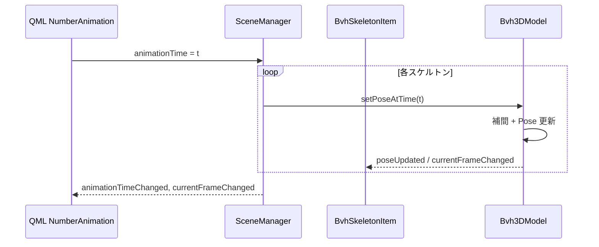

# Scene Manager 設計

## 目的

[architecture.md](./architecture.md) で定義された **Scene Manager (Controller & Adapter)** 層の責務を具体化する。  
C++ Backend（BVH File Model / 3D Data Model）と QML View Layer の橋渡しを行い、複数 BVH スケルトンの読み込み・アニメーション制御・シーン配置を一元管理する。

---

## アーキテクチャ上の位置

```
┌─────────────────────────────────────────────────────────────┐
│  QML View Layer (Main.qml, Bvh3DView.qml, SideBar.qml)    │
│  Repeater3D, View3D, タイムライン UI                         │
└───────────────────────────┬─────────────────────────────────┘
                            │ BvhScene 1.0 (QML module)
                            │ SceneManager, BvhSkeletonItem
┌───────────────────────────▼─────────────────────────────────┐
│  Scene Manager  ← 本ドキュメント                             │
│  src/ui/bvhscene/                                           │
│  SceneManager, BvhSkeletonItem                              │
└───────────────────────────┬─────────────────────────────────┘
                            │ setFrame() / setPoseAtTime()
                            │ std::shared_ptr<BvhFile>
┌───────────────────────────▼─────────────────────────────────┐
│  3D Data Model 層 (src/core/bvhdatamodel)                     │
│  Bvh3DModel, BvhJointListModel, BvhBoneListModel            │
└───────────────────────────┬─────────────────────────────────┘
                            │
┌───────────────────────────▼─────────────────────────────────┐
│  BVH File Model 層 (src/core/bvhfile)                       │
└─────────────────────────────────────────────────────────────┘
```

### 基本方針

| 方針 | Scene Manager での解釈 |
|------|--------------------------|
| 座標計算の委譲 | Pose（Joint/Bone 位置・回転）は `Bvh3DModel` が BVH 座標系で算出。複数スケルトンの **併置オフセット** (`sceneOffset`) は Scene Manager が QML 親 `Node.position` へ提供する。 |
| データのフラット化 | QML は `BvhJointListModel` / `BvhBoneListModel` を `Repeater3D` で直接バインド。Scene Manager はリスト内容を再計算しない。 |
| アニメーション駆動 | QML の `NumberAnimation` が `animationTime`（秒）を更新 → Scene Manager が全スケルトンに `setPoseAtTime(t)` を伝播。シークバー操作時は整数 `currentFrame` で `setFrame(n)` を全スケルトンへ同期適用。 |

---

## スコープ

### 含む

- 複数 BVH ファイルの読み込み・削除・一覧表示（`QAbstractListModel`）
- 各スケルトンへの `Bvh3DModel` 生成と `shared_ptr<BvhFile>` 共有所有
- 再生状態（`playing`）、グローバル時間（`animationTime`）、フレーム同期（`currentFrame`）
- スケルトン単位の表示/非表示、色（ジョイント/ボーン）、シーンオフセット
- 複数読込時の自動 X 軸併置（200 単位間隔）
- QML モジュール `BvhScene` として C++ 型を公開

### 含まない

- BVH パース（BvhFile）
- Joint/Bone 座標計算（Bvh3DModel）
- Qt Quick 3D 描画プリミティブの選択（QML View）
- サイドバー階層ツリー（将来 BvhFile 静的構造を直接利用）
- マウスヒットテスト用ワールド行列取得（将来拡張）

### 既存コードとの関係

- `src/ui/bvhscenemodel.*` / `bvhscenelistmodel.*` は旧 2D プロトタイプ由来。**本設計の対象外**とし、新実装 (`src/ui/bvhscene/`) に置き換える。
- `src/ui/bvhviewitem.*` も旧 2D 描画用。本タスクでは参照しない。

---

## 要件との対応

| 要件 ID | 内容 | Scene Manager での対応 |
|---------|------|------------------------|
| F01 | BVH インポート | `SceneManager::loadScene(QUrl)` |
| F02 | 一覧・削除 | `QAbstractListModel` + `removeScene(int)` |
| F03 | 3D 描画・色分け・表示切替 | `BvhSkeletonItem` が `jointColor` / `boneColor`（effective）/ `boneColorMode` / `boneTone` / `customBoneColor` / `visible` 等を公開 |
| F04 | 複数併置 | 追加時に X 軸へ等間隔 `sceneOffset` を自動設定 |
| F08–F09 | 再生・シーク | `playing`, `animationTime`, `currentFrame` |
| F11 | 複数同期再生 | 時間/フレーム更新を **全スケルトン** に一括適用 |
| F11-2 | Frame Time 準拠・補間 | `setPoseAtTime(t)` を各 `Bvh3DModel` へ委譲 |

---

## クラス構成

### クラス一覧

| クラス | 基底 | 責務 |
|--------|------|------|
| `SceneManager` | `QAbstractListModel` | シーン全体のコントローラ。スケルトン一覧、再生制御、ファイル I/O 開始 |
| `BvhSkeletonItem` | `QObject` | 1 スケルトンエントリの QML 向けファサード（`Bvh3DModel` + メタデータ） |

### 内部エントリ構造

```cpp
struct SkeletonEntry {
    std::shared_ptr<BvhFile> bvhFile;
    std::unique_ptr<Bvh3DModel> model;
    BvhSkeletonItem* item;      // QML 公開用（QObject 寿命は entry と同期）
    QString sourcePath;
    QVector3D sceneOffset;
};
```

**所有権**

- `SceneManager` が `SkeletonEntry` ベクタを所有。
- `bvhFile` と `model` は `shared_ptr` / `unique_ptr` で管理。`Bvh3DModel` コンストラクタへ `bvhFile` のコピーを渡し参照カウント +1。
- `BvhSkeletonItem` は非所有ポインタで `Bvh3DModel*` を参照。

---

## 公開 API

### SceneManager

```cpp
class SceneManager : public QAbstractListModel {
    Q_OBJECT
    QML_ELEMENT

    // 一覧・選択
    Q_PROPERTY(int activeIndex READ activeIndex WRITE setActiveIndex NOTIFY activeIndexChanged)
    Q_PROPERTY(BvhSkeletonItem* activeScene READ activeScene NOTIFY activeIndexChanged)
    Q_PROPERTY(int sceneCount READ sceneCount NOTIFY sceneCountChanged)

    // アニメーション（全スケルトン同期）
    Q_PROPERTY(bool playing READ isPlaying WRITE setPlaying NOTIFY playingChanged)
    Q_PROPERTY(qreal animationTime READ animationTime WRITE setAnimationTime NOTIFY animationTimeChanged)
    Q_PROPERTY(int currentFrame READ currentFrame WRITE setCurrentFrame NOTIFY currentFrameChanged)
    Q_PROPERTY(int frameCount READ frameCount NOTIFY frameCountChanged)
    Q_PROPERTY(double frameTime READ frameTime NOTIFY frameTimeChanged)

    // 直近ロードエラー
    Q_PROPERTY(QString lastError READ lastError NOTIFY lastErrorChanged)

public:
    Q_INVOKABLE bool loadScene(const QUrl& fileUrl);
    Q_INVOKABLE bool removeScene(int index);
    Q_INVOKABLE BvhSkeletonItem* skeletonAt(int index) const;
    Q_INVOKABLE int count() const;

    Q_INVOKABLE void play();
    Q_INVOKABLE void pause();
    Q_INVOKABLE void toggle();

    // ListModel roles: name, source, valid, frameCount, currentFrame, frameTime
};
```

### BvhSkeletonItem

```cpp
class BvhSkeletonItem : public QObject {
    Q_OBJECT
    QML_UNCREATABLE("Created by SceneManager")

    Q_PROPERTY(Bvh3DModel* model READ model CONSTANT)
    Q_PROPERTY(BvhJointListModel* jointModel READ jointModel CONSTANT)
    Q_PROPERTY(BvhBoneListModel* boneModel READ boneModel CONSTANT)

    Q_PROPERTY(QVector3D sceneOffset READ sceneOffset WRITE setSceneOffset NOTIFY sceneOffsetChanged)
    Q_PROPERTY(bool visible READ visible WRITE setVisible NOTIFY visibleChanged)
    Q_PROPERTY(QColor jointColor READ jointColor WRITE setJointColor NOTIFY jointColorChanged)
    Q_PROPERTY(QColor boneColor READ boneColor NOTIFY boneColorChanged)
    Q_PROPERTY(Bvh3DModel::BoneColorMode boneColorMode READ boneColorMode WRITE setBoneColorMode NOTIFY boneColorModeChanged)
    Q_PROPERTY(int boneTone READ boneTone WRITE setBoneTone NOTIFY boneToneChanged)
    Q_PROPERTY(QColor customBoneColor READ customBoneColor WRITE setCustomBoneColor NOTIFY customBoneColorChanged)
    Q_PROPERTY(int paletteIndex READ paletteIndex CONSTANT)
    Q_PROPERTY(QString displayName READ displayName NOTIFY displayNameChanged)
    Q_PROPERTY(QUrl source READ source CONSTANT)
    Q_PROPERTY(bool valid READ isValid NOTIFY validChanged)
    Q_PROPERTY(int frameCount READ frameCount NOTIFY frameCountChanged)
    Q_PROPERTY(double frameTime READ frameTime NOTIFY frameTimeChanged)
    Q_PROPERTY(int currentFrame READ currentFrame NOTIFY currentFrameChanged)
};
```

`visible` / 色関連プロパティ / `displayName` は内部 `Bvh3DModel` へ委譲し、変更シグナルを転送する。色のデータモデル・UI 仕様は [スケルトン色選択仕様](../requirements/skeleton-colors.md) を参照。

---

## アニメーション駆動フロー

### 再生（F11, F11-2）



### シーク（F09）

1. ユーザーがスライダーを操作 → `SceneManager.currentFrame = n`
2. 全 `Bvh3DModel::setFrame(n)` を呼び出し
3. `animationTime` を `n * frameTime`（アクティブスケルトン基準）へ同期

### フレーム数・時間の扱い

[アニメーションコントロール要件・仕様書](../requirements/animation-controls.md) に従う。

- タイムライン算出の対象は **読み込み済み・有効な全スケルトン**（表示・選択状態に非依存）。
- ポーズ更新（`setPoseAtTime`）は **表示中（visible）** のスケルトンのみ。
- `frameTime` = 集計対象の **最小** `Frame Time`。
- `duration` = 集計対象の **`(frameCount - 1) × frameTime` の最大値**（BVH 慣習）。
- `frameCount`（シーン）= `floor(duration / frameTime) + 1` を推奨。端数問題時は最大 `frameCount` でも可。
- 正の再生位置は `animationTime`（秒）。`currentFrame` はそこから導出する。
- `setPoseAtTime(animationTime)` は表示対象スケルトンのみに適用する。
- QML 駆動は `NumberAnimation` の `from: 0` 固定バインドではなく、経過時間積算（Timer 等）を推奨。

---

## 併置レイアウト（F04）

スケルトン追加・削除のたびに X 軸方向へ等間隔オフセットを再計算する。

```
spacing = 200.0
center  = (count - 1) / 2.0
offsetX(i) = (i - center) * spacing
sceneOffset = (offsetX, 0, 0)
```

Y/Z は UI（SideBar SpinBox）または将来のドラッグ操作で変更可能。自動併置は X のみ。

---

## 色分け（F03）

読み込み順にパレットを循環割当:

`#67C1FF`, `#FF9F5E`, `#7BF59F`, `#D17BFF`, `#FFD464`

色の状態は `Bvh3DModel` が保持する（`jointColor`, `boneTone`, `customBoneColor`, `boneColorMode`, effective な `boneColor`）。QML は `BvhSkeletonItem` 経由で読み書きし、トーン計算のユーティリティは `Bvh3DModel.colorFromTone()` / `Bvh3DModel.defaultBoneTone()` を使用する。

---

## QML モジュール

| 項目 | 値 |
|------|-----|
| URI | `BvhScene` |
| バージョン | `1.0` |
| 配置 | `src/ui/bvhscene/` |
| ビルド | `qt_add_qml_module(... STATIC)` |
| リンク | `app_bvhviewer` から `target_link_libraries` |

### QML 使用例

```qml
import BvhScene 1.0

SceneManager { id: sceneManager }

// 3D 描画（Bvh3DView.qml）
Repeater3D {
    model: sceneManager.count
    delegate: Node {
        required property int index
        property BvhSkeletonItem skeleton: sceneManager.skeletonAt(index)

        visible: skeleton.visible
        position: skeleton.sceneOffset

        Repeater3D {
            model: skeleton.jointModel
            Model {
                source: "#Sphere"
                position: model.position
                scale: Qt.vector3d(isEndSite ? 0.3 : 0.5, isEndSite ? 0.3 : 0.5, isEndSite ? 0.3 : 0.5)
                materials: [ PrincipledMaterial { baseColor: skeleton.jointColor } ]
            }
        }

                materials: [ PrincipledMaterial { baseColor: skeleton.boneColor } ]
            }
        }
    }
}
```

---

## ディレクトリ構成

```
src/ui/bvhscene/
  ├── CMakeLists.txt
  ├── scenemanager.h / scenemanager.cpp
  └── bvhskeletonitem.h / bvhskeletonitem.cpp
```

ルート `CMakeLists.txt` にはソースを直接追加せず、`add_subdirectory(src/ui/bvhscene)` のみ追加する。

---

## エラーハンドリング

| 状況 | 動作 |
|------|------|
| 非ローカル URL | `loadScene` が `false`、`lastError` に理由を設定 |
| ファイル不存在 | 同上 |
| BvhFile パース失敗 | 同上。`Bvh3DModel` は生成しない |
| 範囲外 `removeScene` / `activeIndex` | `false` または no-op + `qWarning` |

---

## 将来拡張

| 機能 | 拡張方法 |
|------|----------|
| カメラ自動追従 | `SceneManager` に `cameraTarget` プロパティ追加、QML バインディング |
| 照明設定 | `lightBrightness` 等を SceneManager 経由で Bvh3DView に公開 |
| 併置モード選択 | `LayoutMode` enum（Overlap / Spaced / Grid） |
| ワールド座標ヒットテスト | QML `Node` から `mapPositionToScene` 結果を SceneManager へ通知 |
| 個別再生 | スケルトン単位 `playing` フラグ（現状は全体同期のみ） |

---

## 参考

- [architecture.md](./architecture.md)
- [3d-data-model.md](./3d-data-model.md)
- [requirements.md](../requirements/requirements.md)
